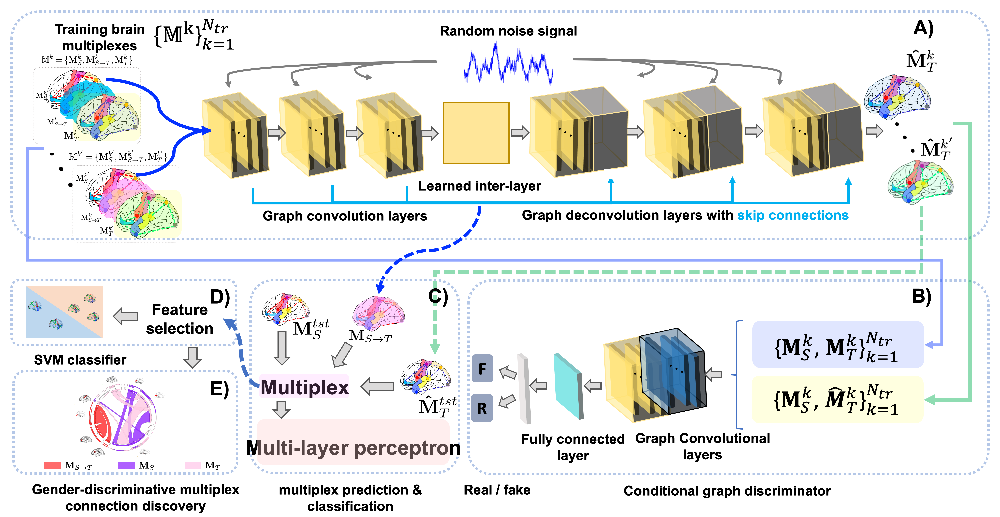
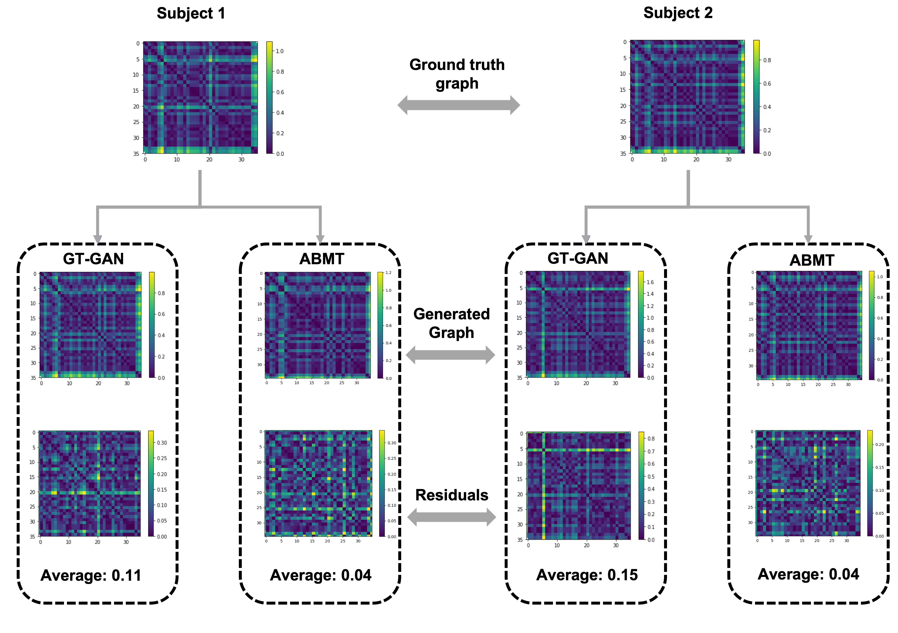
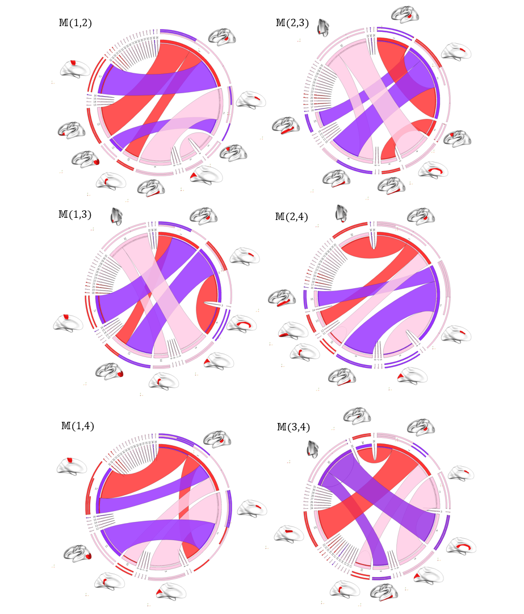

# **ABMT in Python (Adversarial Brain Multiplex Translator)**

ABMT (Adversarial Brain Multiplex Translator) for brain graph translation using geometric generative adversarial network (gGAN). Please contact: [mr.ahmednebli@gmail.com](mailto:mr.ahmednebli@gmail.com) for further inquiries. Thanks.

Existing conventional multiplex building methods aim to create a brain multiplex uses two ground truth intra layers and a predefined convolutional inter-layer. However, our method uses only one intra-layer to predict both brain multiplex target intra-layer and the inter-layer capturing the high-order relationship between both intra-layers (i.e., network to network relationship).

# Detailed proposed ABMT framework

Adversarial Brain Multiplex Translator (ABMT) is the first work for predicting brain multiplexes from a source network using geometric adversarial learning to investigate gender differences in the human brain. Given a set of morphological brain multiplexes, we train a brain network translator to learn how to translate a source multiplex intra-layer to the target intra-layer . The translator architecture mimics that of U-Net comprising encoding and decoding layers with additional skip connections to pass over sample-specific representations to the encoding layers. The conditional network discriminator inputs for training sets of pairs of multiplex layers: in order to discriminate the pair including the ground truth from the predicted one by the translator for each training subject . We produce the final multiplex = by stacking the source intra-layer, the predicted intra-layer, and the learned inter-layer. Then, we train a multi-layer perceptron (MLP) that classifies each subject&#39;s multiplex into male and female classes. The MLP helps predict the multiplex via supervision by sample labels. We further perform feature selection followed by an independent support vector machine (SVM) classifier. We hypothesize that this would ensure a better classification since the SVM has not interfered in the learning process. Identification of the most gender discriminative connectivities are shown in the circular graphs. Notably, these connectivities belong to both intra-layers as well as the high-order inter-layer.

# Libraries to pre-install in Python

Numpy: [https://numpy.org/](https://numpy.org/)

TensorFlow: [https://www.tensorflow.org/](https://www.tensorflow.org/)

Scikit-learn: [https://scikit-learn.org/stable/install.html](https://scikit-learn.org/stable/install.html)

#

# Demo

ABMT is coded in Python 3. GPU is not a requirement to run the code. However, for faster training it is mandatory to install TensorFlow-gpu.

To run ABMT please run main.py. If you require only to run a demo without training, please choose the configuration: &quot;No training / Yes testing&quot; when asked to do so. 

For a complete training and testing please choose the configuration &quot;Yes training / Yes testing&quot;. 

If you are using the code for the first time please run training at least for one epoch to configure the weights.

#

**Data preparation**

We simulated random graph dataset, each representing a brain network (source and target), using the function Utils\_.py. Each graph contains 35 brain regions. To load your own data please modify the function load\_data in Utils\_.py to upload your own dataset.

To train and evaluate ABMT code for classification on other datasets, you need to upload your data as a structure including:

• A tensor of size (N × m ×m) containing N symmetric matrices each one representing a subject graph of size (m × m). N denotes the number of subjects and m denotes the number of nodes (regions of interest in our case).
 • A (N ×1) label list including the label of each subject in the dataset (male or female).

The ABMT outputs are:

• A matrix of size (N ×m × m) storing the network of the predicted subjects.

# Example Results

We show a visualization of generated brain graphs from two randomly chosen source subjects. We also show a qualitative difference between our proposed ABMT and a comparison method GT-GAN.

We show the most gender-discriminative connectivities found in each layer of the multiplex. These connectivities are represented as circular graphs.

#

# Related references

Guo, Xiaojie, Lingfei Wu, and Liang Zhao. &quot;Deep graph translation.&quot; arXiv preprint arXiv:1805.09980 (2018). [[https://arxiv.org/abs/1805.09980](https://arxiv.org/abs/1805.09980)]

Lisowska, Anna, et al. &quot;Joint pairing and structured mapping of convolutional brain morphological multiplexes for early dementia diagnosis.&quot; Brain connectivity 9.1 (2019): 22-36. [[https://www.liebertpub.com/doi/full/10.1089/brain.2018.0578](https://www.liebertpub.com/doi/full/10.1089/brain.2018.0578)]

# Please cite the following paper when using ABMT:

@article{nebli2020, 
 title={Adversarial Brain Multiplex Prediction From a Single Brain Network with Application to Gender Fingerprinting}, 
 author={Nebli, Ahmed and Rekik, Islem}, 
 journal={Medical Image Analysis}, 
 volume={??}, 
 pages={???}, 
 year={2020}, 
 publisher={Elsevier} 
 } 

# License

Our code is released under MIT License (see LICENSE file for details).
